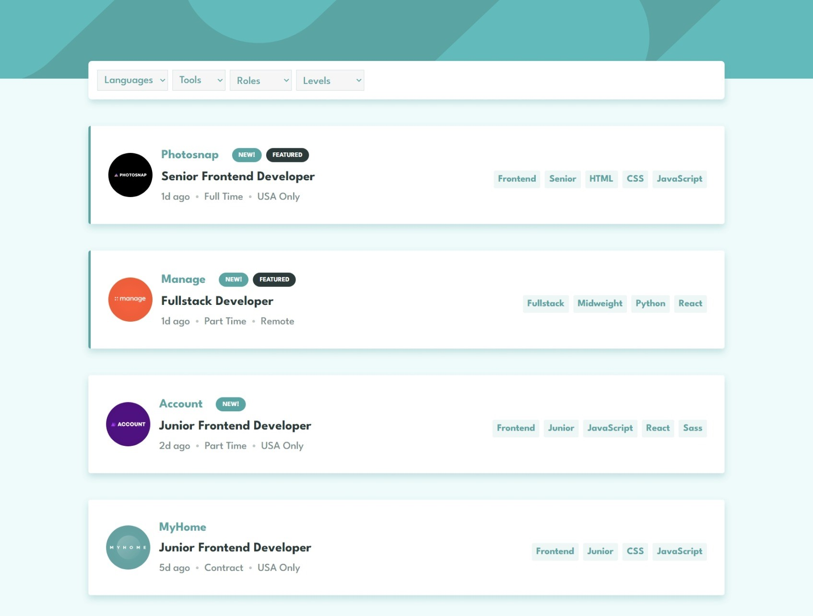

# Welcome to my Frontend Mentor Challenge repository! 👋
# Job listings with filtering solution

This is a solution to the [Job listings with filtering challenge on Frontend Mentor](https://www.frontendmentor.io/challenges/job-listings-with-filtering-ivstIPCt). Frontend Mentor challenges help you improve your coding skills by building realistic projects. 

## Table of contents

- [Overview](#overview)
  - [The challenge](#the-challenge)
  - [Screenshot](#screenshot)
  - [Links](#links)
- [My process](#my-process)
  - [Built with](#built-with)
  - [What I learned](#what-i-learned)
  - [Continued development](#continued-development)
  - [Useful resources](#useful-resources)
- [Author](#author)
- [Acknowledgments](#acknowledgments)

## Overview

### The challenge

Users should be able to:

- View the optimal layout for the site depending on their device's screen size
- See hover states for all interactive elements on the page
- Filter job listings based on the categories

### Screenshot

### Links

- Solution URL: [github](https://github.com/salma247/job-listing-with-filtering)
- Live Site URL: [live](https://salma247.github.io/job-listing-with-filtering/)

## My process

### Built with

- Semantic HTML5 markup
- CSS custom properties
- Flexbox
- Mobile-first workflow
- [React](https://reactjs.org/) - JS library
- [Redux](https://redux.js.org/) - State management

### What I learned

I learned how to use Redux to manage the state of the application. I also learned how to use the React Context API to pass data between components.
I also learned to add lazy loading to components to improve performance.

### Continued development

I want to continue to learn more about Redux and how to use it in my projects. 

### Useful resources

- [toolkit](https://redux-toolkit.js.org/) - This helped me understand how to use Redux in my project. I really liked this pattern and will use it going forward.

## Author

- github - [github](https://github.com/salma247)
- Frontend Mentor - [@salma247](https://www.frontendmentor.io/profile/salma247)

